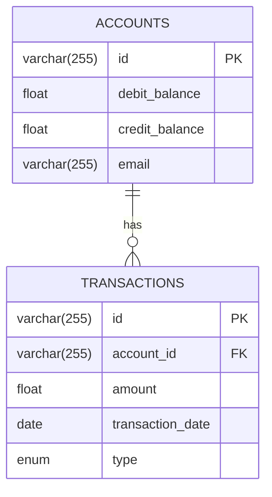

# transactions-summary
Stori technical challenge.

### Purpose
system that processes a file from a mounted directory and send summary information to a user in the form of an email.

### Database

```mermaid
erDiagram
    ACCOUNTS ||--o{ TRANSACTIONS : has
    ACCOUNTS {
        varchar(255) id PK
        float debit_balance
        float credit_balance
        varchar(255) email
    }
    TRANSACTIONS {
        varchar(255) id PK
        varchar(255) account_id FK
        float amount
        date transaction_date
        enum type
    }
```
